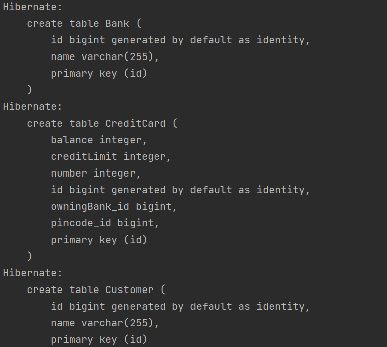
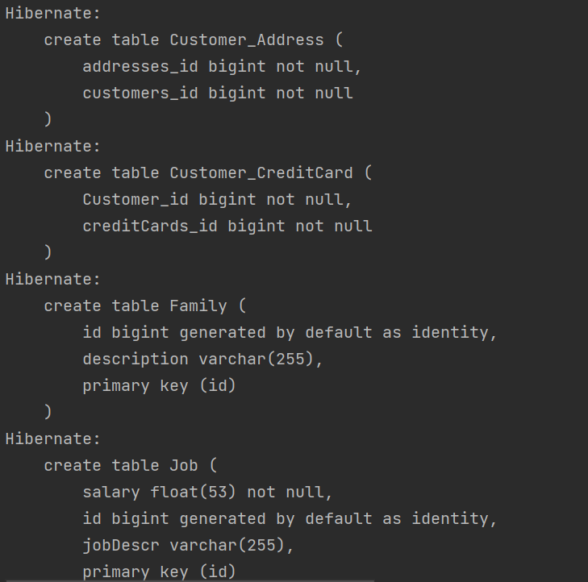
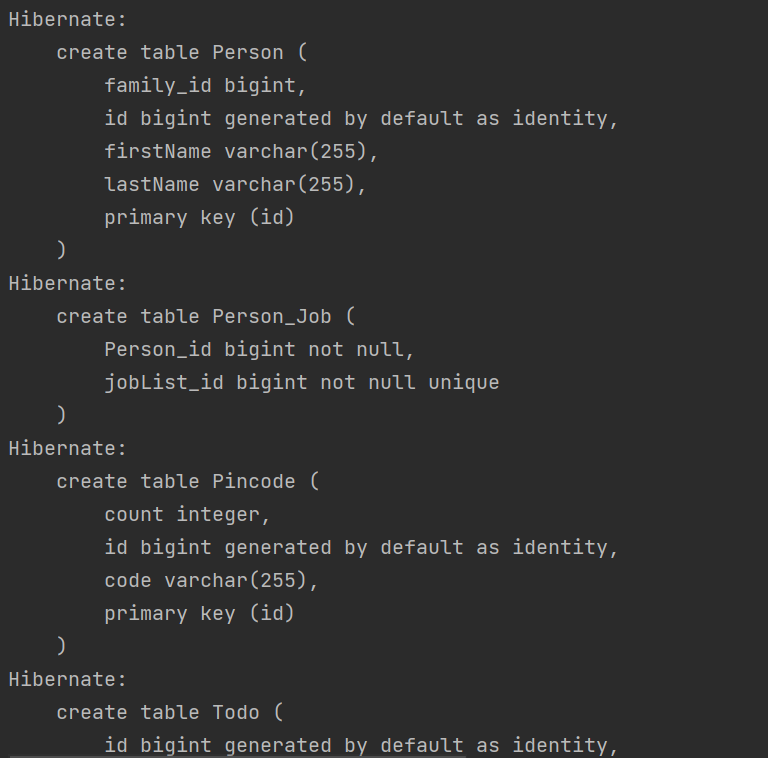

Report: 

I had no issues during installation and use of Java Persistence Architecture (JPA) 

link to code: https://github.com/mikkelgunhildsbu/dat250-jpa-tutorial/tree/master/src/main/java/no/hvl/dat250/jpa/tutorial/creditcards

In order to inspect the database table I went into the persistence.xml file and changed hibernate.show.sql to true. This prints the tables that are created when the code is run. These are the tables that were created:

